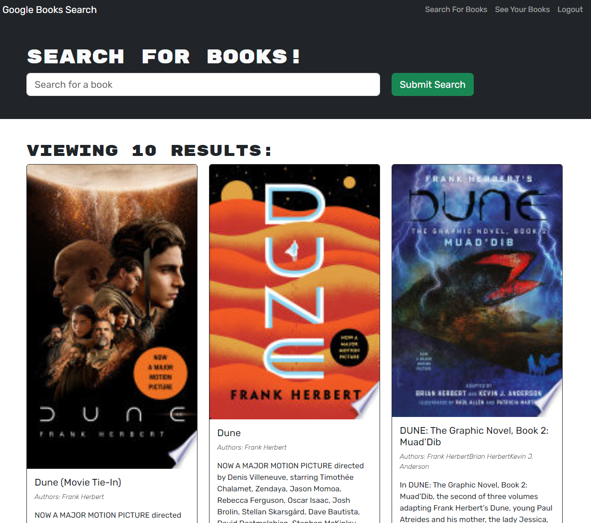

## Book Search Engine

## Description
📌The app was built using the MERN stack, with a React front end, MongoDB database, and Node.js/Express.js server and API. Code functionality - user login, signUp and logOut, also allow users to search for book and save them to the back end.

## Installation
🖇️Installation is no needed. 

## Tools Used
✔️ React
✔️ Express.js
✔️ JWT
✔️ Mongoose
✔️ Apollo
✔️ GraphQL
✔️ Bootstrap
✔️ React-Router-Dom

## License
Please refer to the LICENSE in the repo.

## Contributing
🤝Contributors welcome for code improvement.

## Book Search Engine View

## Questions
If you have any questions find me on [GitHub](https://github.com/oprokopieva382) or feel free email me oprokopieva382@gmail.com

## Links
Check this out [Render](https://)
